## Clustering Overview

- Unsupervised learning
- Requires data, but no labels
- Detect patterns e.g. in
  - Group emails or search results
  - Customer shopping patterns
  - Regions of images
- Useful when don't know what you're looking for
- But: can get gibberish

## Workshop Overview

This presentation will teach you the basics of clustering, including:

- Understanding the concept of clustering
- Learning about the K-means algorithm
- Implementing K-means in practical scenarios
- Exploring image segmentation using K-means


## Basic Concept
::: {.columns}
::: {.column width="50%"}
- Basic idea: group together similar instances
- Example: 2D point patterns
:::
::: {.column width="50%"}
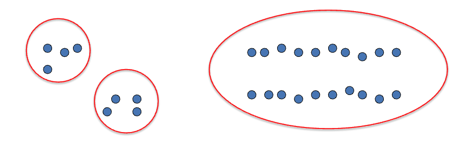
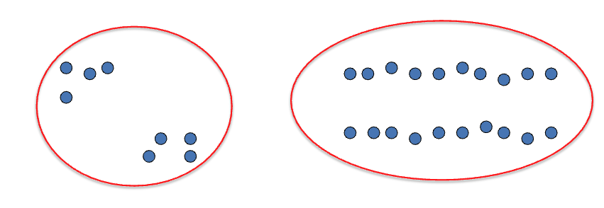
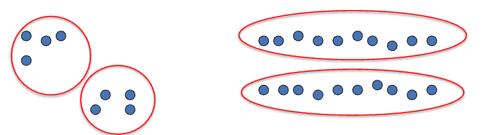
:::
:::

## Similarity Measures

- What could similar mean?
  - One option: small Euclidean distance (squared)
  - Clustering results are crucially dependent on the measure of similarity (or distance) between "points" to be clustered

$$dist(\vec{x}, \vec{y}) = ||\vec{x} - \vec{y}||^2_2$$

## Clustering Algorithms

Two main categories:

::: {.columns}
::: {.column width="60%"}
1. Hierarchical algorithms
   - Bottom-up: agglomerative
   - Top-down: divisive
   
2. Partitional algorithms (flat)
   - K-means
   - Mixture of Gaussians
   - Spectral Clustering
:::
::: {.column width="40%"}
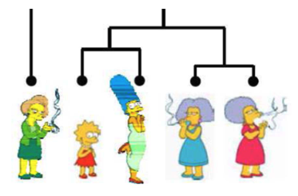
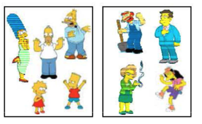
:::
:::

## Clustering Examples: Image Segmentation {.smaller}

::: {.columns}
::: {.column width="50%"}
Goal: Break up the image into meaningful or perceptually similar regions
:::
::: {.column width="50%"}
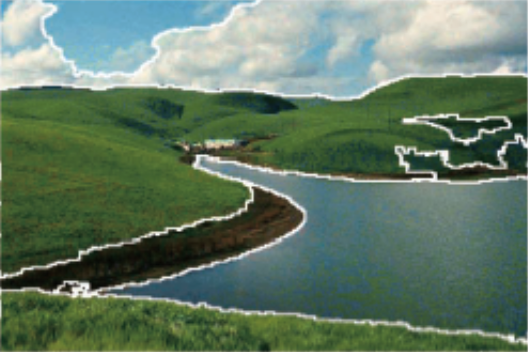
:::
:::

## K-Means Algorithm

An iterative clustering algorithm:

1. Initialize: Pick K random points as cluster centers
2. Alternate:
   - Assign data points to closest cluster center
   - Change the cluster center to the average of its assigned points
3. Stop when no points assignments change

## K-Means Visualization

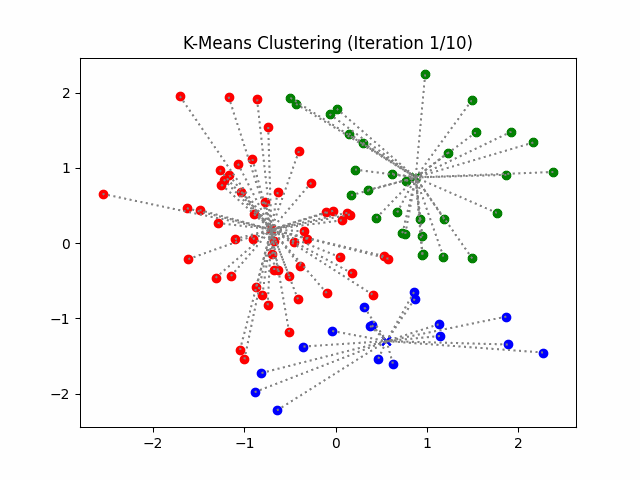{width=60% fig-align="center"}

## K-Means Example: Step 1

::: {.columns}
::: {.column width="50%"}
Initial random centers (K=2)
:::
::: {.column width="50%"}
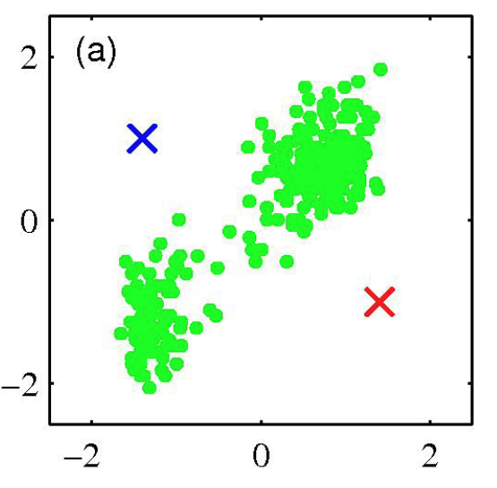
:::
:::

## K-Means Example: Step 2

::: {.columns}
::: {.column width="50%"}
Assign points to nearest center
:::
::: {.column width="50%"}
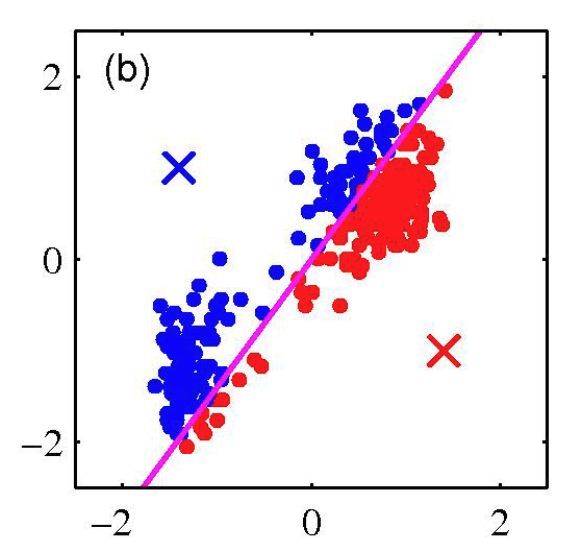
:::
:::

## K-Means Example: Step 3

::: {.columns}
::: {.column width="50%"}
Repeat until convergence
:::
::: {.column width="50%"}
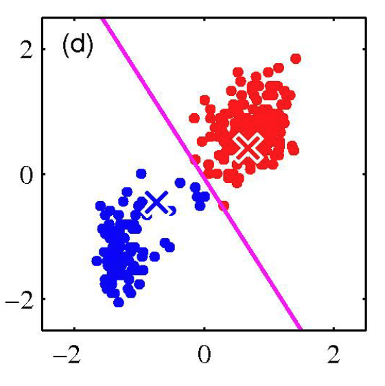
:::
:::

## K-Means Example: Step 4

::: {.columns}
::: {.column width="50%"}
Change the cluster center to the average of the assigned points
:::
::: {.column width="50%"}
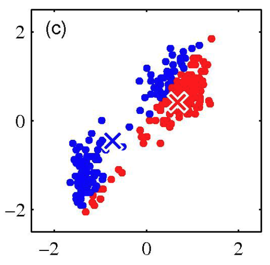
:::
:::

## Properties of K-means Algorithm

- Guaranteed to converge in a finite number of iterations
- Running time per iteration:
  1. Assign data points to closest cluster center: O(KN) time
  2. Change the cluster center to average of assigned points: O(N)

## K-Means Getting Stuck 
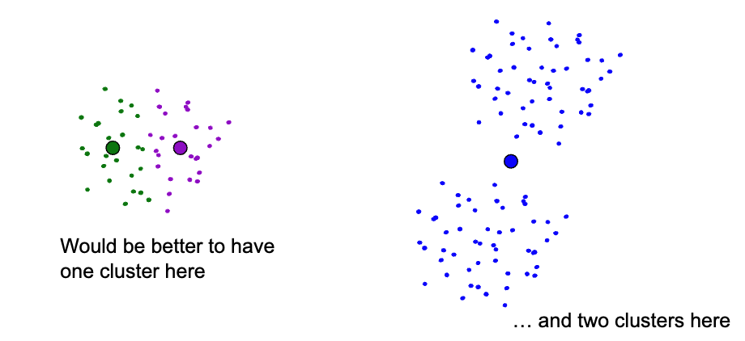

## Example of cases where K-Means gets stuck
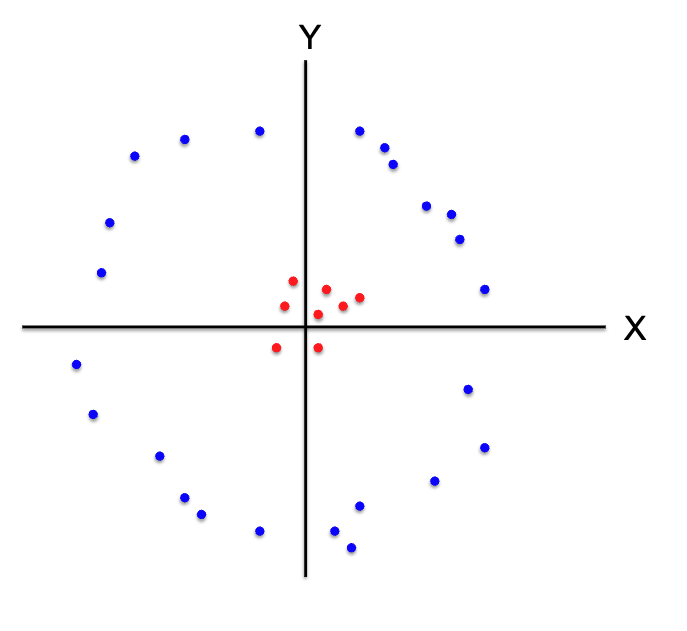

## How we can handle such cases
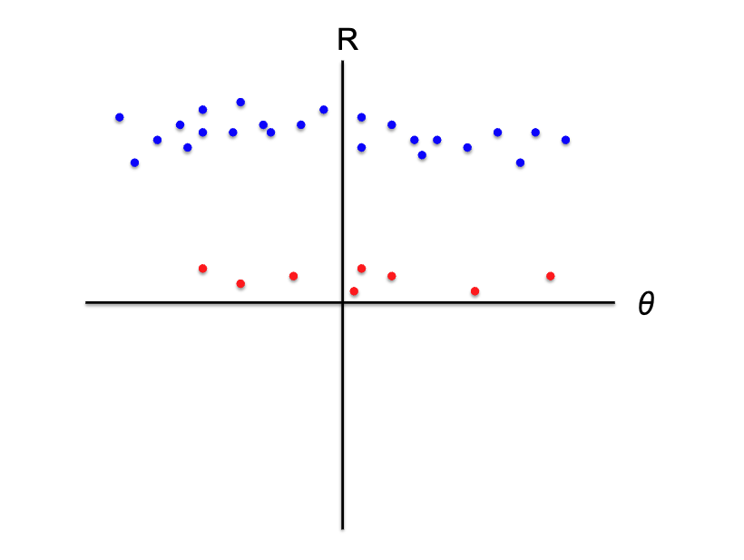


## Workshop Part 1: K-Means from Scratch {.smaller}
Let's implement K-means clustering step by step!

```python
import numpy as np
import matplotlib.pyplot as plt
from IPython import display
import time

# For reproducibility
np.random.seed(42)
```

## Generate Sample Data {.smaller}
```python
# Generate 3 clusters
cluster1 = np.random.normal(loc=[2, 2], scale=0.5, size=(100, 2))
cluster2 = np.random.normal(loc=[8, 3], scale=0.5, size=(100, 2))
cluster3 = np.random.normal(loc=[5, 7], scale=0.5, size=(100, 2))

# Combine all data
data = np.vstack([cluster1, cluster2, cluster3])

# Number of clusters
k = 3

# Initialize centers randomly
centers = data[np.random.choice(len(data), k, replace=False)]
```


## Function 1: Assign Clusters {.smaller}
```python
def assign_clusters(data, centers):
    """
    Assign each data point to nearest center
    
    Args:
        data: Array of data points (n_samples, n_features)
        centers: Array of cluster centers (k, n_features)
    Returns:
        Array of cluster assignments for each point
    """
    distances = np.sqrt(((data - centers[:, np.newaxis]) ** 2).sum(axis=2))
    return np.argmin(distances, axis=0)
```

## Function 2: Update Centers {.smaller}

```python
def update_centers(data, labels, k):
    """
    Update cluster centers to mean of assigned points
    
    Args:
        data: Array of data points
        labels: Cluster assignments for each point
        k: Number of clusters
    Returns:
        Array of new cluster centers
    """
    return np.array([data[labels == i].mean(axis=0) for i in range(k)])
```

## Function 3: K-means Visualization{.smaller}
 Part 1 
```python
def kmeans_visualize(data, k, max_iters=100):
    """
    Run K-means clustering with visualization
    
    Args:
        data: Input data points
        k: Number of clusters
        max_iters: Maximum iterations
    """
    # Initialize centers randomly
    centers = data[np.random.choice(len(data), k, replace=False)]
    
    plt.figure(figsize=(10, 6))
```

## Function 3: K-means Visualization {.smaller}
 Part 2
```python
    for i in range(max_iters):
        # Assign clusters
        labels = assign_clusters(data, centers)
        
        plt.clf()
        
        # Plot data points with cluster colors
        for j in range(k):
            cluster_points = data[labels == j]
            plt.scatter(cluster_points[:, 0], cluster_points[:, 1], 
                       label=f'Cluster {j + 1}')
```
## Function 3: K-means Visualization {.smaller}
 Part 3
```python
        # Update centers
        new_centers = update_centers(data, labels, k)
        
        # Plot old and new centers
        plt.scatter(centers[:, 0], centers[:, 1], color='black', 
                   marker='x', s=100, label='Old Centers')
        plt.scatter(new_centers[:, 0], new_centers[:, 1], color='red',
                   marker='x', s=100, label='New Centers')
```

## Function 3: K-means Visualization {.smaller}
 Part 4
```python
        # Check convergence
        if np.all(new_centers == centers):
            break
            
        centers = new_centers
        
        plt.title(f'Iteration {i + 1}')
        plt.legend(loc='upper left')
        
        display.clear_output(wait=True)
        display.display(plt.gcf())
        time.sleep(0.5)
    
    plt.show()
```

## Running K-means {.smaller}

```python
# Run K-means visualization
kmeans_visualize(data, k)
```

## Workshop Part 2: Image Segmentation {.smaller}

Let's segment an image using K-means

```python
import numpy as np
import matplotlib.pyplot as plt
import cv2

# Read in the image
image = cv2.imread('image.png')

# Change color to RGB (from BGR)
image = cv2.cvtColor(image, cv2.COLOR_BGR2RGB)
 
plt.imshow(image)
```
## Pre Processing the Image

```python
# Reshaping the image into a 2D array of pixels and 3 color values (RGB)
pixel_vals = image.reshape((-1,3))
 
# Convert to float type
pixel_vals = np.float32(pixel_vals)
```
## Setting Stop Conditions for the Algorithm
This line sets the stopping criteria: either 100 iterations or 85% accuracy.
```python
criteria = (cv2.TERM_CRITERIA_EPS + cv2.TERM_CRITERIA_MAX_ITER, 100, 0.85)
```

## Perform K-Means
Random Centers are initally chosen.
```python
k = 3
retval, labels, centers = cv2.kmeans(pixel_vals, k, None, criteria, 10, cv2 KMEANS_RANDOM_CENTERS)
```

## Convert Data into 8-Bit and then into the original image dimension

```python
# convert data into 8-bit values
centers = np.uint8(centers)
segmented_data = centers[labels.flatten()]
 
# reshape data into the original image dimensions
segmented_image = segmented_data.reshape((image.shape))

plt.imshow(segmented_image)
```

## Thank you

